# CANZIM FinTrack — System Description & Feature Reference

> **Developed with ❤️ by bguvava ([bguvava.com](https://bguvava.com))**  
> **Client:** Climate Action Network Zimbabwe (CAN Zimbabwe) — [canzimbabwe.org.zw](https://www.canzimbabwe.org.zw/)  
> **Version:** 1.0.0 | **Currency:** USD$ | **Target Users:** 50 staff members

---

## Table of Contents

1. [System Overview](#1-system-overview)
2. [Architecture](#2-architecture)
3. [User Roles & Access Control](#3-user-roles--access-control)
4. [Module 1 — Authentication & Session Security](#4-module-1--authentication--session-security)
5. [Module 2 — Landing Page](#5-module-2--landing-page)
6. [Module 3 — Dashboard](#6-module-3--dashboard)
7. [Module 4 — User Management](#7-module-4--user-management)
8. [Module 5 — Project Management](#8-module-5--project-management)
9. [Module 6 — Budget Management](#9-module-6--budget-management)
10. [Module 7 — Expense Management](#10-module-7--expense-management)
11. [Module 8 — Cash Flow Management](#11-module-8--cash-flow-management)
12. [Module 9 — Purchase Order Management](#12-module-9--purchase-order-management)
13. [Module 10 — Donor Management](#13-module-10--donor-management)
14. [Module 11 — Reports & Analytics](#14-module-11--reports--analytics)
15. [Module 12 — Document Management](#15-module-12--document-management)
16. [Module 13 — Comments System](#16-module-13--comments-system)
17. [Module 14 — System Settings](#17-module-14--system-settings)
18. [Module 15 — Audit Trail](#18-module-15--audit-trail)
19. [Module 16 — Activity Logs](#19-module-16--activity-logs)
20. [Module 17 — Help & User Manual](#20-module-17--help--user-manual)
21. [Database Schema Overview](#21-database-schema-overview)
22. [API Reference Summary](#22-api-reference-summary)
23. [Testing Structure](#23-testing-structure)
24. [Notifications System](#24-notifications-system)

---

## 1. System Overview

**CANZIM FinTrack** is a web-based Enterprise Resource Planning (ERP) / Financial Management and Accounting System developed specifically for **Climate Action Network Zimbabwe (CAN Zimbabwe)**. It provides a centralised platform for managing all financial activities — from project budgeting and expense tracking to donor management, cash flow monitoring, and regulatory reporting.

| Attribute          | Value                               |
| ------------------ | ----------------------------------- |
| Application Type   | Single Page Application (SPA)       |
| Backend Framework  | Laravel 12 (PHP 8.2)                |
| Frontend Framework | Vue.js 3 + Pinia                    |
| CSS Framework      | Tailwind CSS v4                     |
| Database           | MySQL (`my_canzimdb`)               |
| API Architecture   | RESTful API (versioned: `/api/v1/`) |
| Authentication     | Laravel Sanctum (token-based)       |
| Currency           | USD$ (single currency)              |
| Language           | English                             |
| PDF Generation     | DomPDF                              |
| Charts             | Chart.js (via Vue wrappers)         |

---

## 2. Architecture

```
CANZIM-FinTrack/
├── app/
│   ├── Http/Controllers/Api/     # RESTful API controllers (versioned)
│   ├── Http/Requests/            # Form Request validation classes
│   ├── Http/Resources/           # Eloquent API Resources
│   ├── Models/                   # Eloquent models (26 models)
│   ├── Services/                 # Business logic services (22 services)
│   ├── Policies/                 # Authorization policies (12 policies)
│   ├── Notifications/            # Email/DB notifications (6 types)
│   └── Exceptions/               # Custom exceptions
├── resources/
│   ├── js/
│   │   ├── pages/                # Vue.js SPA pages (30+ pages)
│   │   ├── components/           # Reusable Vue components
│   │   ├── stores/               # Pinia state stores
│   │   └── plugins/              # SweetAlert2, etc.
│   └── views/                    # Blade shell templates (thin wrappers)
├── routes/
│   ├── api.php                   # All REST API routes (v1)
│   └── web.php                   # SPA route shells
├── database/
│   ├── migrations/               # 40+ database migrations
│   ├── factories/                # Model factories for testing
│   └── seeders/                  # Database seeders
└── tests/
    ├── Feature/                  # Feature integration tests
    ├── Unit/                     # Unit tests
    ├── CashFlow/                 # Cash flow specific tests
    └── PurchaseOrders/           # Purchase order specific tests
```

**Request Flow:**

1. Browser loads blade shell → Vue.js SPA bootstraps
2. Vue Router handles all client-side navigation
3. Pinia stores manage application state
4. All data interactions go through `/api/v1/` (Laravel Sanctum protected)
5. Authorization enforced via Laravel Policies on every resource

---

## 3. User Roles & Access Control

The system implements three distinct roles with fine-grained permissions enforced via Laravel Policies.

| Role             | Slug               | Description                                                                                                |
| ---------------- | ------------------ | ---------------------------------------------------------------------------------------------------------- |
| Programs Manager | `programs-manager` | Full system administrator — organisation-wide financial overview, user management, settings, all approvals |
| Finance Officer  | `finance-officer`  | Financial operations — expenses, cash flow, purchase orders, bank accounts, reports                        |
| Project Officer  | `project-officer`  | Project-level access — submits expenses, manages project documents, views project budgets                  |

### Permission Matrix (Key Operations)

| Feature                 | Programs Manager | Finance Officer | Project Officer |
| ----------------------- | :--------------: | :-------------: | :-------------: |
| User Management         |     ✅ Full      |       ❌        |       ❌        |
| System Settings         |     ✅ Full      |       ❌        |       ❌        |
| Audit Trail             |     ✅ View      |       ❌        |       ❌        |
| Project Management      |     ✅ Full      |  ✅ View/Edit   | ✅ Own Projects |
| Budget Approval         |    ✅ Approve    |    ✅ Create    |       ❌        |
| Expense Submission      |        ✅        |       ✅        |       ✅        |
| Expense Review          |        ✅        |    ✅ Review    |       ❌        |
| Expense Approval        |    ✅ Approve    |       ❌        |       ❌        |
| Purchase Order Approval |    ✅ Approve    |       ❌        |       ❌        |
| Cash Flow Management    |     ✅ Full      |     ✅ Full     |       ❌        |
| Donor Management        |     ✅ Full      |     ✅ View     |       ❌        |
| Reports                 |      ✅ All      |  ✅ Financial   |   ✅ Project    |
| Documents               |     ✅ Full      |     ✅ Full     |   ✅ Project    |
| Activity Logs           |     ✅ Full      |       ❌        |       ❌        |

---

## 4. Module 1 — Authentication & Session Security

### Screenshot: Landing Page / Login

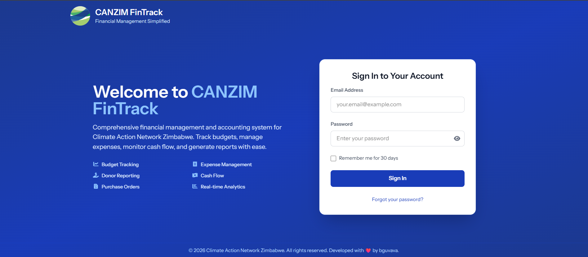

_The landing page features an animated login form on a blue gradient background, alongside a feature highlights panel that showcases the system capabilities._

### Screenshot: Session Locking

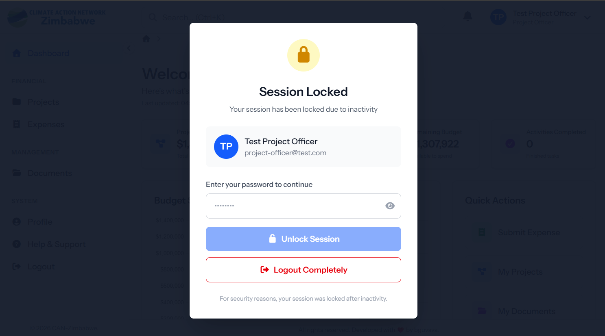

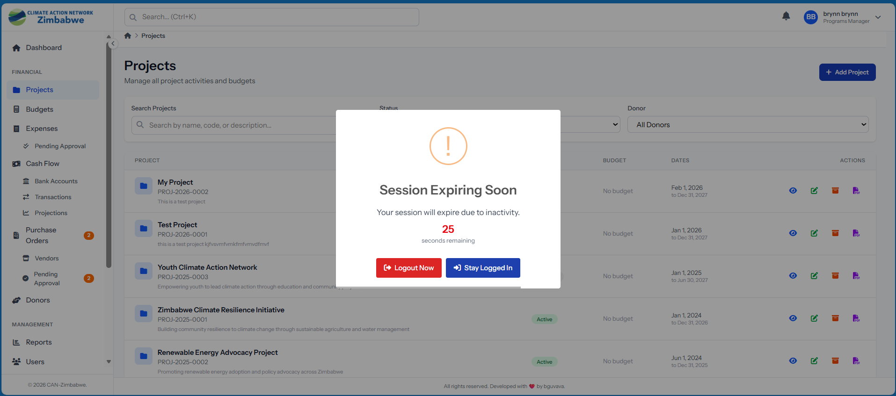

_The session lock screen appears after 5 minutes of inactivity. Users must re-enter their password to unlock without losing their work context._

### Features

- **Token-based authentication** via Laravel Sanctum
- **Password reset** via email link (token-based, time-limited)
- **Account lockout** after failed login attempts (tracked: `failed_login_attempts`, `locked_until`)
- **Session timeout** — 5-minute inactivity timer with a 30-second countdown warning dialog
- **Session locking** — locks screen without logging out; user re-enters password to unlock
- **IP address tracking** — records `last_login_ip` and IP on each activity log entry
- **Role validation on init** — on page reload, validates user role is one of the 3 authorised roles
- **Persistent sessions** — token/user stored in `localStorage` with session lock state preserved across page refreshes
- **Password verification** endpoint for sensitive operations

### Security Controls

| Control                | Implementation                                  |
| ---------------------- | ----------------------------------------------- |
| Brute force protection | Account lockout with configurable threshold     |
| Session inactivity     | 5-minute auto-lock (configurable)               |
| API authentication     | Sanctum bearer token on every `/api/v1` request |
| Authorization          | Laravel Policies on every model operation       |
| Soft deletes           | Users, Projects, Budgets, Expenses, Donors, POs |
| Input validation       | Form Request classes for all mutations          |
| HTTPS enforced         | Production deployment requirement               |

---

## 5. Module 2 — Landing Page

The landing page (`/`) serves as the application entry point and authentication gateway.

### Features

- Animated hero section with CANZIM logo and branding
- Feature highlights grid (Budget Tracking, Expense Management, Cash Flow, Reports, etc.)
- Integrated login form (email + password + remember me)
- Forgot password link → email-based password reset flow
- Responsive design (mobile / tablet / desktop)
- Dark blue gradient background (`from-blue-900 via-blue-800 to-blue-900`)

---

## 6. Module 3 — Dashboard

### Screenshot: Dashboard

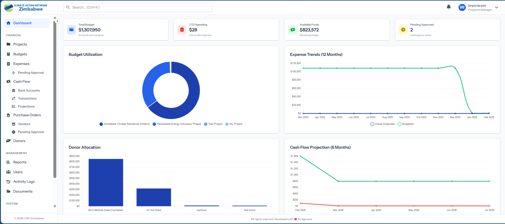

_The role-aware dashboard displays KPI cards, interactive charts, recent activity, and budget utilisation metrics tailored to the logged-in user's role._

### Features — Programs Manager View

**KPI Cards (4):**

- Total Budget — sum across all active projects
- YTD Spending — year-to-date approved expenses
- Active Projects — count of in-progress projects
- Pending Approvals — expenses + POs awaiting approval

**Charts:**

- Budget vs Actual spending by project (bar chart)
- Monthly cash flow trend (line chart)
- Expense category breakdown (doughnut)
- Project status distribution (pie)

**Activity Feed:**

- Recent expense submissions
- Budget alerts (when utilisation exceeds thresholds)
- New project creations
- Approval decisions

### Features — Finance Officer View

**KPI Cards:**

- Cash balance across bank accounts
- Pending expenses count + value
- This month's outflows
- Outstanding purchase orders

**Charts:**

- Cash flow inflows vs outflows (monthly)
- Expense status pipeline

### Features — Project Officer View

**KPI Cards:**

- My projects budget total
- My submitted expenses this month
- Projects in progress
- Pending approvals for my submissions

**Notifications panel** — real-time count badge with per-notification read/unread state

---

## 7. Module 4 — User Management

### Features

- **Full CRUD** for staff accounts (Programs Manager only)
- **Avatar upload** — profile image stored in `storage/app/public`
- **Role assignment** — Programs Manager, Finance Officer, Project Officer
- **Office location** — maps user to a specific office branch
- **Account status** — `active` / `inactive` toggle
- **Soft deletes** — deactivated accounts are never hard-deleted
- **User search** — live search by name / email
- **Activity history** — view per-user system activity log
- **Self-service profile** — all users can update own name, phone, avatar, and change password

### User Model Fields

| Field                   | Description              |
| ----------------------- | ------------------------ |
| `name`                  | Full name                |
| `email`                 | Login email (unique)     |
| `phone_number`          | Optional contact number  |
| `office_location`       | Branch/office assignment |
| `avatar_path`           | Profile image path       |
| `role_id`               | FK → roles table         |
| `status`                | active / inactive        |
| `failed_login_attempts` | Brute force counter      |
| `locked_until`          | Lockout expiry timestamp |
| `last_login_at`         | Last successful login    |
| `last_login_ip`         | IP at last login         |

---

## 8. Module 5 — Project Management

### Screenshot: Add Project

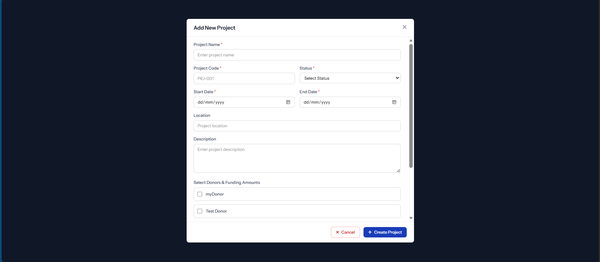

_The project creation form captures project code, name, dates, budget allocation, office location, and initial team member assignments._

### Features

- **Project CRUD** — create, view, edit, soft-delete
- **Project codes** — unique identifier per project (e.g. `PRJ-2025-001`)
- **Status tracking** — `planning` → `active` → `completed` → `archived`
- **Date management** — start date, end date with validation
- **Budget integration** — total_budget displayed with live utilisation
- **Team member assignment** — assign multiple staff to a project with role context
- **Donor linkage** — projects linked to donors via `project_donors` pivot table (funding amount, period, restricted/unrestricted flag)
- **Office location** — ties project to specific office branch
- **Archive** — soft-archives completed projects
- **PDF project report** generation
- **Statistics endpoint** — aggregate counts by status

### Project Model Relationships

```
Project
  ├── creator (User)
  ├── budgets (Budget[])
  ├── expenses (Expense[])
  ├── donors (Donor[] via project_donors pivot)
  ├── teamMembers (User[] via project_user pivot)
  ├── cashFlows (CashFlow[])
  ├── purchaseOrders (PurchaseOrder[])
  └── documents (polymorphic)
```

---

## 9. Module 6 — Budget Management

### Screenshot: Budget Management

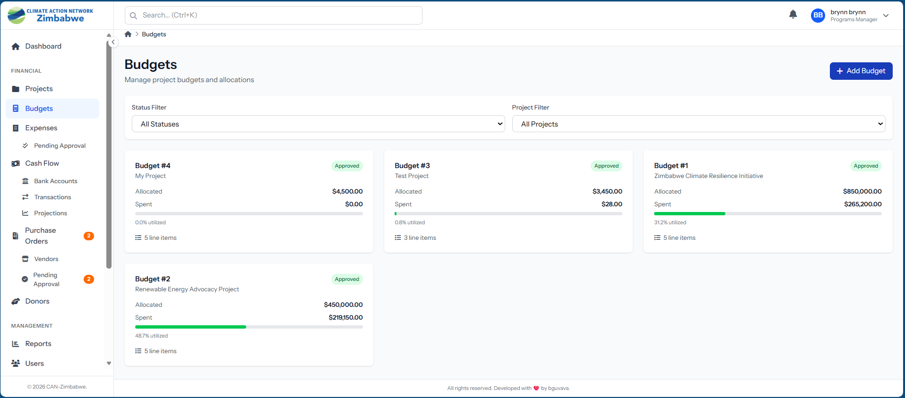

_The budget management screen shows budget allocation by category, utilisation percentages, approval status, and drill-down into individual budget line items._

### Features

- **Budget creation** per project per fiscal year
- **Budget line items** — categorised line items with allocated amounts
- **Approval workflow** — draft → approved (Programs Manager approves)
- **Budget reallocation** — request transfer between budget items; requires approval
- **Live utilisation** — computed attributes: `total_allocated`, `total_spent`, `total_remaining`, `utilization_percentage`
- **Category management** — predefined expense categories
- **Budget alerts** — notifications triggered when utilisation exceeds threshold (configurable in settings)
- **Soft deletes** on budgets and items

### Budget Model Computed Properties

| Attribute                | Calculation                                       |
| ------------------------ | ------------------------------------------------- |
| `total_allocated`        | Sum of all budget item `allocated_amount`         |
| `total_spent`            | Sum of all approved expenses against budget items |
| `total_remaining`        | `total_allocated - total_spent`                   |
| `utilization_percentage` | `(total_spent / total_allocated) * 100`           |

---

## 10. Module 7 — Expense Management

### Screenshot: Expense Approval

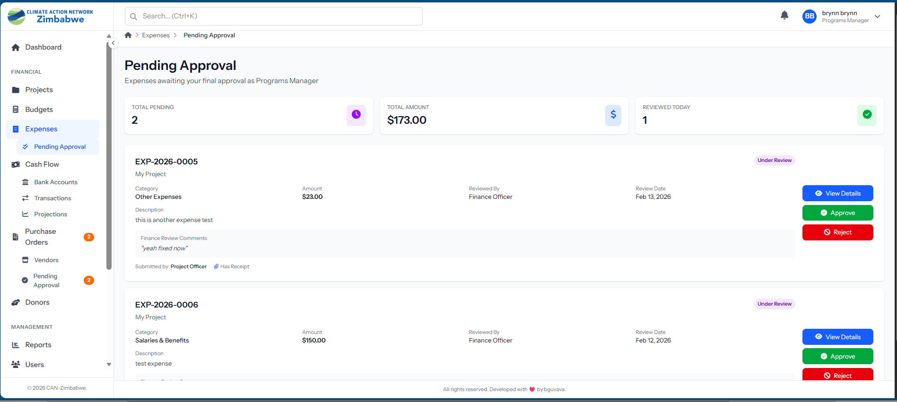

_The expense approval interface shows a multi-step pipeline with pending review queue, approval actions, rejection with reason capture, and full audit comments._

### Features

**Multi-Step Approval Workflow:**

```
Draft → [Submit] → Pending Review → [Review] → Pending Approval → [Approve/Reject] → Approved → [Mark Paid] → Paid
```

- **Draft** — created by any role; editable
- **Submit** — locks expense, sends notification to reviewer
- **Review** — Finance Officer reviews receipts and categorisation
- **Approve/Reject** — Programs Manager final approval with optional comment
- **Mark Paid** — records payment reference, method, and date
- **Rejection** — captures reason; expense returned to submitter

**Expense Fields:**

- Expense number (auto-generated: `EXP-YYYY-NNN`)
- Project linkage
- Budget item linkage (maps to correct budget line)
- Expense category (from configurable categories)
- Date, amount, description
- Receipt upload (PDF/image) — stored securely in `storage/app/private`
- Payment method and reference (on payment)
- Purchase Order linkage (optional — for PO-backed expenses)

**Views:**

- **My Expenses** — filtered to own submissions
- **Pending Review** — Finance Officer review queue
- **Pending Approval** — Programs Manager approval queue
- **All Expenses** — Programs Manager full list with filters

**Exports:**

- Individual expense PDF (with receipt reference)
- Expense list PDF (filtered/date-ranged)

**Notifications:**

- `ExpenseSubmittedNotification` → reviewer
- `ExpenseReviewedNotification` → submitter (when reviewed)
- `ExpenseApprovedNotification` → submitter
- `ExpenseRejectedNotification` → submitter

---

## 11. Module 8 — Cash Flow Management

### Screenshot: Cash Flow Management

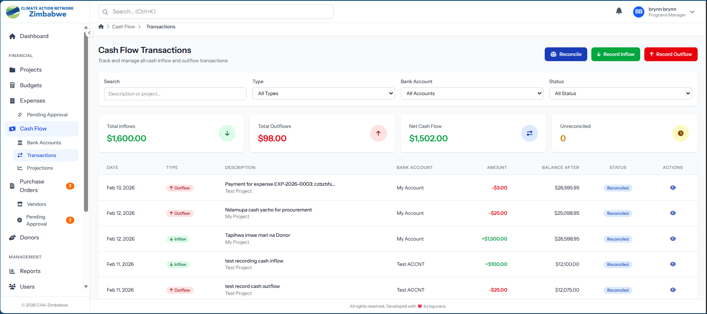

### Screenshot: Projections

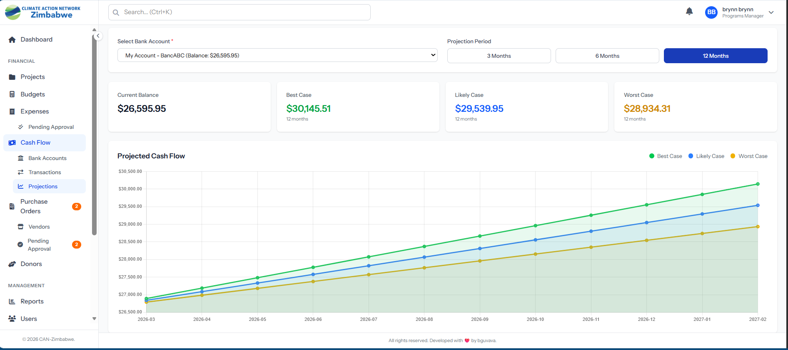

_The cash flow screen provides a real-time view of inflows and outflows by bank account, with reconciliation status, transaction search, and PDF statement export. The projections view shows trend forecasting._

### Features

**Bank Accounts:**

- Create and manage multiple bank accounts
- `account_name`, `account_number`, `bank_name`, `branch`, `currency`, `current_balance`
- Activate / deactivate accounts
- Per-account reconciliation report PDF export

**Transactions:**

- Record **inflows** (donor receipts, grants received)
- Record **outflows** (expense payments, transfers)
- Running balance tracking (`balance_before`, `balance_after`)
- Transaction reference and description
- Link transactions to Projects and Donors
- Link outflow to approved Expense records

**Reconciliation:**

- Mark individual transactions as reconciled/unreconciled
- `is_reconciled`, `reconciled_at`, `reconciled_by` fields
- Reconciliation report PDF per bank account

**Projections:**

- 6-month forward cash flow projection based on historical patterns
- Visual chart (line graph) showing projected inflows vs outflows
- Drill-down into projected vs actual by month

**Exports:**

- Cash flow statement PDF (date range, bank account filter)
- Reconciliation report PDF

**Statistics:**

- Total inflows / outflows
- Current cash position
- Reconciled vs unreconciled transaction counts

---

## 12. Module 9 — Purchase Order Management

### Screenshot: Vendor Management

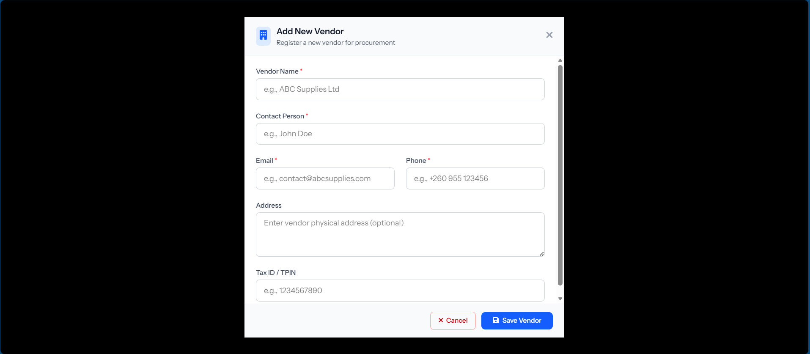

_The vendor management panel shows vendor profiles, contact details, payment status history, and activity summary per vendor._

### Features

**Vendor Management:**

- CRUD for supplier/vendor profiles
- `name`, `contact_person`, `email`, `phone`, `address`, `tax_id`, `payment_terms`
- Activate / deactivate vendors
- Per-vendor summary (total POs, total value, payment status breakdown)

**Purchase Order Workflow:**

```
Draft → [Submit] → Pending Approval → [Approve/Reject] → Approved → [Receive] → Received → [Complete] → Completed
                                                        ↓
                                                    Cancelled
```

**PO Fields:**

- PO number (auto-generated: `PO-YYYY-NNN`)
- Vendor linkage
- Project linkage
- Order date, expected delivery date, actual delivery date
- Line items: description, quantity, unit price, subtotal
- Tax amount, total amount
- Terms & conditions
- Rejection reason (when rejected)

**Features:**

- Multi-line item PO creation
- PDF PO document generation
- Link PO to expense records (when goods/services received)
- Pending approval queue view
- Vendor payment status export (PDF)
- PO list PDF export

---

## 13. Module 10 — Donor Management

### Screenshot: Donor Management

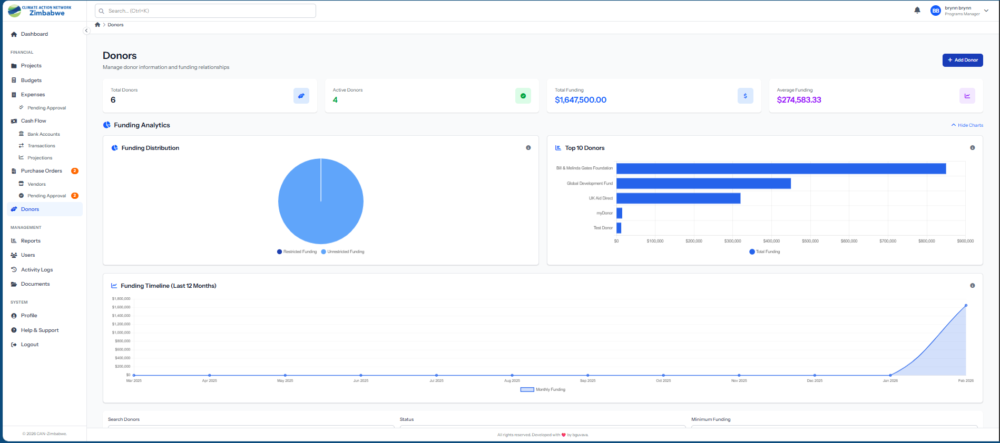

_The donor management module tracks all funding sources, including project assignments, funding amounts, restricted vs unrestricted funding classification, in-kind contributions, and communication history._

### Features

**Donor Profiles:**

- `name`, `contact_person`, `email`, `phone`, `address`, `tax_id`, `website`
- Status: `active` / `inactive`
- Notes field for internal context
- Soft deletes with restore capability

**Project Assignment:**

- Link donors to multiple projects
- Per-assignment: `funding_amount`, `funding_period_start`, `funding_period_end`, `is_restricted`, `notes`
- Restricted vs unrestricted funding classification

**Funding Analytics:**

- `total_funding` — sum of all project contributions
- `restricted_funding` — restricted allocations
- `unrestricted_funding` — unrestricted allocations
- `in_kind_total` — total in-kind contribution value
- Funding timeline chart (monthly contribution history)
- Funding summary per donor (breakdown by project)

**In-Kind Contributions:**

- Record non-cash donations: equipment, services, goods
- Date, description, estimated_value fields
- Linked to donor record

**Communications Log:**

- Track all donor communications (emails, meetings, calls)
- Polymorphic communication model supports Projects and Donors
- Date, subject, content, type fields

**Exports:**

- Donor financial report PDF
- Donor contribution history PDF

**Statistics:**

- Total donors, active/inactive counts
- Total funding by donor (chart data)
- Top donors by contribution

---

## 14. Module 11 — Reports & Analytics

### Screenshot: Reports

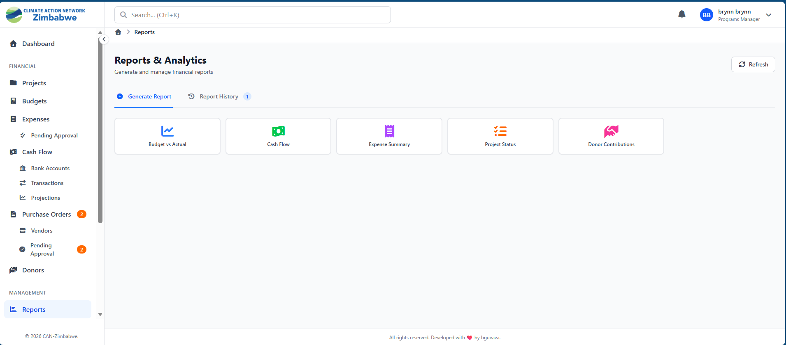

_The reports module provides 6 standard report types plus a custom report builder, with PDF export, report history, and date/project/donor filtering._

### Available Report Types

| Report Type           | Description                                                             |
| --------------------- | ----------------------------------------------------------------------- |
| Budget vs Actual      | Compares allocated budgets against actual spending per project/category |
| Cash Flow Report      | Inflows and outflows over a time period with balance trend              |
| Expense Summary       | Breakdown of expenses by category, project, status, and period          |
| Project Status Report | Progress overview of all projects including budget utilisation          |
| Donor Contributions   | Funding received by donor with project allocation details               |
| Custom Report         | Flexible builder — choose data source, filters, columns, and grouping   |

### Features

- **Report generation** — select type, date range, project/donor filters → generate
- **Report history** — list of previously generated reports with metadata
- **PDF export** — download any report as a formatted PDF document
- **Custom report builder** — select from Projects, Expenses, Budget, CashFlow data sources; apply filters; choose output columns
- **Report storage** — generated reports saved in `reports` table with metadata (type, parameters, generated_by, generated_at)
- **Tab navigation** — Generate Report | Report History tabs
- **Delete reports** from history

---

## 15. Module 12 — Document Management

### Screenshot: Documents

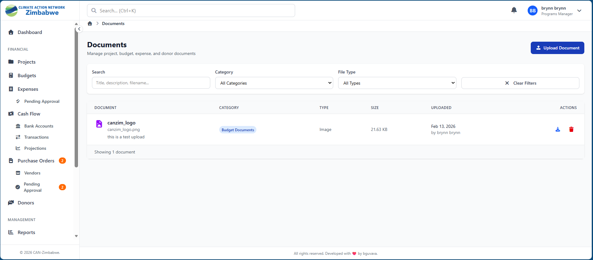

_The document management system supports polymorphic document linking (to projects, expenses, donors), version control, category organisation, and secure download._

### Features

- **Polymorphic documents** — documents can be attached to Projects, Expenses, Donors, or standalone
- **Document categories** — configurable category taxonomy (Contracts, Reports, Receipts, etc.)
- **Version control** — each document tracks version history; new uploads create new versions
- **File metadata** — `title`, `description`, `file_name`, `file_path`, `file_type`, `file_size`, `version_number`
- **Secure access** — download via signed URLs; files stored outside web root
- **Category management** — create and manage document categories
- **Search & filter** — filter by category, file type, date range
- **View in browser** — inline viewing for PDFs and images
- **Upload** — drag-and-drop with progress indicator
- **Soft deletes** — documents are soft-deleted, not permanently removed

### Document Version Tracking

Each document maintains a `versions` relationship:

```
Document → DocumentVersion[]
         ↳ version_number, file_path, file_name, uploaded_by, created_at
```

---

## 16. Module 13 — Comments System

### Features

- **Polymorphic comments** — comments can be attached to any record type (Expenses, Projects, POs, etc.)
- **Threaded discussions** — contextual comment threads per record
- **File attachments** — attach files to comments (stored securely)
- **Attachment download** — secure download links for comment attachments
- **CRUD** — create, read, update, delete own comments
- **Authorization** — users can only edit/delete their own comments; managers can moderate

---

## 17. Module 14 — System Settings

### Features

**Settings Groups:**

- **General** — organisation name, fiscal year start, currency display
- **Security** — session timeout duration, max failed logins, lockout duration
- **Notifications** — budget alert threshold (% utilisation trigger), email notification toggles
- **Email** — SMTP configuration (from name, reply-to, etc.)
- **Backup** — backup schedule settings

**System Utilities:**

- **Clear Cache** — flushes all Laravel application caches
- **System Health** — displays disk usage, database size, PHP version, Laravel version, memory usage
- **Cache-backed settings** — settings are cached for 1 hour (auto-invalidated on update)

**Access:** Programs Manager only

---

## 18. Module 15 — Audit Trail

### Screenshot: Activity Logging

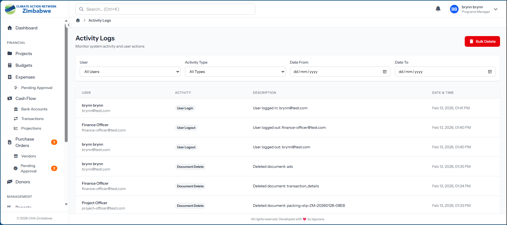

_The audit trail provides a complete, tamper-evident record of all system actions — who did what, when, on which record, and what changed._

### Features

- **Comprehensive tracking** — every create, update, delete, approve, reject action is logged
- **Old/new values** — stores `old_values` and `new_values` as JSON for change comparison
- **Polymorphic auditable** — tracks action against any model type
- **Request context** — captures `ip_address`, `user_agent`, `request_url`, `request_method`
- **User attribution** — links every action to the performing user
- **Immutable records** — no `updated_at` (single `created_at` only), records are never modified
- **Filterable** — filter by action type, user, date range, model type
- **Access:** Programs Manager only

### Tracked Actions (examples)

| Action                       | Trigger           |
| ---------------------------- | ----------------- |
| `user_login` / `user_logout` | Auth events       |
| `expense.submitted`          | Expense submitted |
| `expense.approved`           | Expense approval  |
| `budget.approved`            | Budget approval   |
| `project.created`            | New project       |
| `purchase_order.approved`    | PO approval       |
| `user.created`               | New user created  |
| `settings.updated`           | Settings change   |

---

## 19. Module 16 — Activity Logs

- **Per-user activity** — queryable log of all user actions
- **System-wide log** — Programs Manager can view all user activity
- **Bulk delete** — clean up old log entries
- **IP tracking** — captures IP address per log entry
- **Structured metadata** — stores context data as JSON alongside each log entry

---

## 20. Module 17 — Help & User Manual

### Screenshot: User Manual

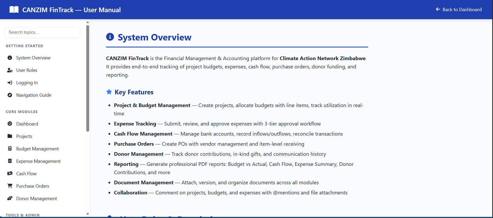

_The built-in help centre provides role-specific guidance, step-by-step workflow instructions, and quick-reference guides for all modules._

### Features

- Dedicated `/dashboard/help` route
- In-app user manual with module-by-module documentation
- Role-specific guidance (shows relevant sections per user role)
- Searchable content
- Step-by-step workflow guides (expense submission, budget creation, etc.)

---

## 21. Database Schema Overview

### Core Tables

| Table                           | Purpose                | Key Fields                                                              |
| ------------------------------- | ---------------------- | ----------------------------------------------------------------------- |
| `users`                         | System users           | role_id, status, failed_login_attempts, locked_until                    |
| `roles`                         | User roles             | name, slug, description                                                 |
| `projects`                      | Projects               | code, name, status, total_budget, start_date, end_date, office_location |
| `project_user`                  | Team members           | project_id, user_id                                                     |
| `budgets`                       | Project budgets        | project_id, fiscal_year, total_amount, status                           |
| `budget_items`                  | Budget line items      | budget_id, category, description, allocated_amount                      |
| `budget_reallocations`          | Budget transfers       | from_item_id, to_item_id, amount, status                                |
| `expense_categories`            | Expense taxonomy       | name, code, description                                                 |
| `expenses`                      | Expense records        | expense_number, project_id, budget_item_id, amount, status              |
| `expense_approvals`             | Approval audit         | expense_id, action, user_id, comments                                   |
| `vendors`                       | Supplier profiles      | name, contact_person, email, tax_id                                     |
| `purchase_orders`               | PO records             | po_number, vendor_id, project_id, status, total_amount                  |
| `purchase_order_items`          | PO line items          | purchase_order_id, description, quantity, unit_price                    |
| `bank_accounts`                 | Bank accounts          | account_name, account_number, bank_name, current_balance                |
| `cash_flows`                    | Transactions           | transaction_number, type, bank_account_id, amount, is_reconciled        |
| `donors`                        | Donor profiles         | name, contact_person, email, status, funding_total                      |
| `project_donors`                | Donor↔Project mapping | donor_id, project_id, funding_amount, is_restricted                     |
| `in_kind_contributions`         | Non-cash donations     | donor_id, date, description, estimated_value                            |
| `communications`                | Donor communications   | communicable_type, communicable_id, type, subject, content              |
| `reports`                       | Generated reports      | type, parameters, generated_by, file_path                               |
| `documents`                     | File documents         | documentable_type, documentable_id, title, version_number               |
| `document_versions`             | Document history       | document_id, version_number, file_path                                  |
| `document_categories`           | Doc taxonomy           | name, description                                                       |
| `comments`                      | Record comments        | commentable_type, commentable_id, user_id, content                      |
| `comment_attachments`           | Comment files          | comment_id, file_path, file_name                                        |
| `activity_logs`                 | User activity          | user_id, action, metadata                                               |
| `audit_trails`                  | Change audit           | user_id, action, auditable_type, old_values, new_values                 |
| `system_settings`               | Config store           | key, group, value, type                                                 |
| `notifications`                 | Laravel notifications  | notifiable_type, notifiable_id, data, read_at                           |
| `personal_access_tokens`        | Sanctum tokens         | tokenable_id, token, abilities                                          |
| `user_notification_preferences` | Notification prefs     | user_id, type, email_enabled, db_enabled                                |

---

## 22. API Reference Summary

All API routes are prefixed with `/api/v1/` and protected by Sanctum (except login/forgot-password).

| Resource           | Endpoints                                                                                       | Module          |
| ------------------ | ----------------------------------------------------------------------------------------------- | --------------- |
| `/auth`            | login, logout, profile, forgot-password, reset-password, verify-password, extend-session        | Auth            |
| `/users`           | CRUD, activate, deactivate, roles, locations, search, activity                                  | User Mgmt       |
| `/profile`         | show, update, change-password, avatar                                                           | Profile         |
| `/projects`        | CRUD, archive, statistics, team-members, budgets                                                | Projects        |
| `/budgets`         | CRUD, approve, categories, reallocations                                                        | Budgets         |
| `/expenses`        | CRUD, submit, review, approve, mark-paid, export-pdf, link-po                                   | Expenses        |
| `/cash-flows`      | index, inflows, outflows, statistics, projections, reconcile, export-statement                  | Cash Flow       |
| `/bank-accounts`   | CRUD, activate, deactivate, summary, reconciliation-report                                      | Bank Accounts   |
| `/purchase-orders` | CRUD, submit, approve, reject, receive, complete, cancel, export-pdf                            | Purchase Orders |
| `/vendors`         | CRUD, activate, deactivate, summary                                                             | Vendors         |
| `/donors`          | CRUD, restore, assign-project, funding-summary, in-kind, communications, report                 | Donors          |
| `/communications`  | CRUD                                                                                            | Communications  |
| `/reports`         | CRUD, budget-vs-actual, cash-flow, expense-summary, project-status, donor-contributions, custom | Reports         |
| `/documents`       | CRUD, view, download, replace, versions, categories                                             | Documents       |
| `/comments`        | CRUD, attachment download                                                                       | Comments        |
| `/settings`        | index, update by group, clear-cache, system-health, backup                                      | Settings        |
| `/activity-logs`   | index, bulk-delete                                                                              | Activity Logs   |
| `/dashboard`       | index (role-aware), notifications, mark-read                                                    | Dashboard       |

---

## 23. Testing Structure

```
tests/
├── Feature/
│   ├── Auth/               # Login, logout, password reset, session
│   ├── Authentication/     # Token management, role validation
│   ├── Budgets/            # Budget CRUD, approvals, reallocations
│   ├── Dashboard/          # Dashboard KPIs per role
│   ├── Documents/          # Document upload, versioning, categories
│   ├── Donors/             # Donor CRUD, project assignment, reports
│   ├── Expenses/           # Expense workflow (all stages)
│   ├── Projects/           # Project CRUD, team members, archiving
│   ├── PurchaseOrders/     # PO workflow, vendor management
│   ├── Reports/            # Report generation, PDF export
│   ├── Settings/           # Settings CRUD, system health
│   ├── Users/              # User management, profile, avatar
│   ├── Comments/           # Comments and attachments
│   └── CommentsSystemTest.php
├── CashFlow/               # Cash flow transactions, reconciliation, projections
├── PurchaseOrders/         # PO-specific tests
├── Unit/                   # Unit tests for services and models
└── Traits/
    └── DatabaseTransactions # Rollback trait (preserves production test data)
```

**Test Requirements:** 100% pass rate — zero failures permitted. Tests use `DatabaseTransactions` trait for safe rollback without affecting real data.

---

## 24. Notifications System

Six email/database notification types are implemented:

| Notification                   | Trigger                              | Recipient                          |
| ------------------------------ | ------------------------------------ | ---------------------------------- |
| `ExpenseSubmittedNotification` | Expense submitted for review         | Finance Officer                    |
| `ExpenseReviewedNotification`  | Expense reviewed (passed/failed)     | Submitter                          |
| `ExpenseApprovedNotification`  | Expense approved                     | Submitter                          |
| `ExpenseRejectedNotification`  | Expense rejected                     | Submitter                          |
| `BudgetApprovedNotification`   | Budget approved by PM                | Budget creator                     |
| `BudgetAlertNotification`      | Budget utilisation exceeds threshold | Programs Manager + Finance Officer |

Notification preferences are stored per user in `user_notification_preferences` (email enabled / database enabled toggles per type).

---

## Summary — Modules & Feature Count

| Module               | Status      | Key Features                                                   |
| -------------------- | ----------- | -------------------------------------------------------------- |
| Authentication       | ✅ Complete | Login, session lock, password reset, brute force protection    |
| Landing Page         | ✅ Complete | Animated login, feature highlights, responsive                 |
| Dashboard            | ✅ Complete | Role-aware KPIs, charts, activity feed, notifications          |
| User Management      | ✅ Complete | CRUD, roles, avatars, status management                        |
| Project Management   | ✅ Complete | CRUD, team members, archiving, PDF reports                     |
| Budget Management    | ✅ Complete | Line items, approval, reallocation, utilisation metrics        |
| Expense Management   | ✅ Complete | 5-stage approval pipeline, receipts, PDF, notifications        |
| Cash Flow Management | ✅ Complete | Bank accounts, transactions, reconciliation, projections, PDF  |
| Purchase Orders      | ✅ Complete | Vendor management, PO workflow, PDF                            |
| Donor Management     | ✅ Complete | Profiles, project assignment, in-kind, communications, reports |
| Reports & Analytics  | ✅ Complete | 6 report types + custom builder, PDF export, history           |
| Document Management  | ✅ Complete | Polymorphic, version control, secure download                  |
| Comments System      | ✅ Complete | Polymorphic comments with file attachments                     |
| System Settings      | ✅ Complete | Grouped settings, cache management, health checks              |
| Audit Trail          | ✅ Complete | Full change history with old/new values                        |
| Activity Logs        | ✅ Complete | User activity tracking with IP                                 |
| Help & User Manual   | ✅ Complete | Role-specific in-app guide                                     |

---

_CANZIM FinTrack — Developed with ❤️ by bguvava ([bguvava.com](https://bguvava.com)) for Climate Action Network Zimbabwe_
