## About Laravel

# CANZIM FinTrack - Financial Management & Accounting System

**Version:** 1.0.0  
**Client:** Climate Action Network Zimbabwe (CAN Zimbabwe)  
**Website:** [www.canzimbabwe.org.zw](https://www.canzimbabwe.org.zw/)  
**Developer:** [bguvava](https://bguvava.com) ❤️

---

## 📋 Project Overview

CANZIM FinTrack is a comprehensive web-based Financial Management and Accounting ERP system built for Climate Action Network Zimbabwe. The system prioritizes financial operations with integrated project management features to support comprehensive financial oversight, accountability, and real-time data accessibility.

### Key Features

- **Financial Management & Accounting** (Primary Focus)
    - Expense tracking and approval workflows
    - Budget allocation and monitoring
    - Cash flow management
    - Purchase order processing
- **Project & Budget Management**
    - Projects as financial containers
    - Multi-project budget tracking
    - Cost allocation across projects
- **Donor & Funding Management**
    - Multi-donor support
    - Donor-specific reporting
    - Funding source tracking
- **Reporting & Analytics**
    - Financial reports (PDF only)
    - Audit trails and activity logs
    - Real-time dashboards
- **User Management**
    - Role-based access control (3 roles)
    - Session management (5-minute timeout)
    - Secure authentication (Laravel Sanctum)

---

## Technology Stack

### Backend

- **PHP:** 8.2.12
- **Laravel:** 12.38.1
- **MySQL:** 8.0+
- **Laravel Sanctum:** 4.2.0 (API Authentication)
- **DomPDF:** 3.1.4 (PDF Generation)
- **Intervention Image:** 3.11.4 (Image Processing)
- **PHPUnit:** 11.5.3 (Testing)
- **Laravel Pint:** 1.24 (Code Formatting)

### Frontend

- **Vue.js:** 3.5.24 (Composition API)
- **Vite:** 7.0.7 (Build Tool)
- **TailwindCSS:** 4.1.17 (Primary Styling)
- **Alpine.js:** 3.15.1 (Micro-interactions)
- **Pinia:** 3.0.4 (State Management)
- **Axios:** 1.13.2 (HTTP Client)
- **Chart.js:** 4.5.1 (Data Visualization)
- **SweetAlert2:** 11.26.3 (Modals & Alerts)
- **VeeValidate:** 4.15.1 (Form Validation)
- **FontAwesome:** 7.1.0 (Icons)
- **Vitest:** 4.0.9 (Frontend Testing)

---

## Quick Start

### Prerequisites

- PHP 8.2+ installed
- Composer installed
- Node.js 18+ and NPM installed
- MySQL 8.0+ running

## 🧪 Testing

The project maintains **100% test coverage** with comprehensive feature and unit tests.

### Run Tests

```bash
# Run all tests
php artisan test

# Run specific test file
php artisan test tests/Feature/EnvironmentSetup/DatabaseConnectionTest.php

# Run tests with coverage
php artisan test --coverage
```

---

## Screenshots

### Landing Page

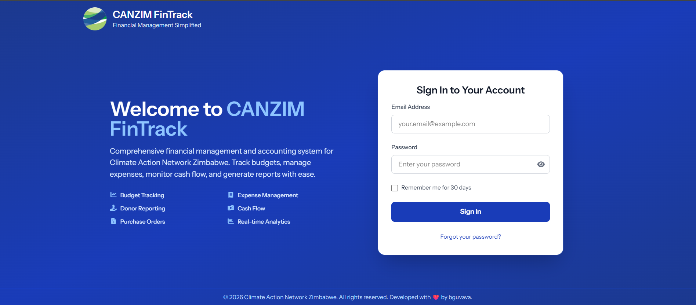
_Branded login screen with CANZIM identity_

### Dashboard

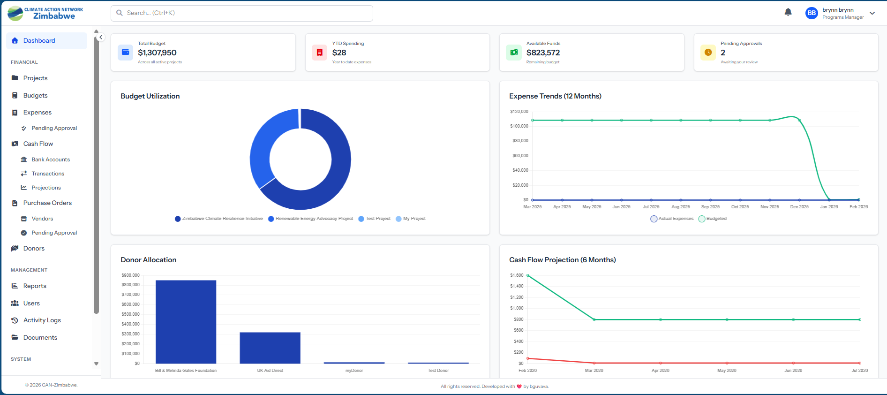
_Role-based financial dashboard with real-time charts and KPIs_

### Project & Budget Management

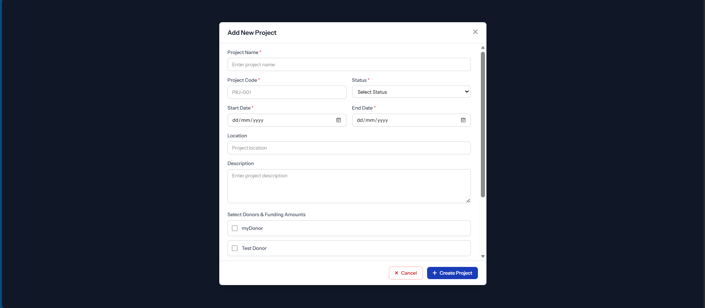
_Create and manage projects as financial containers_

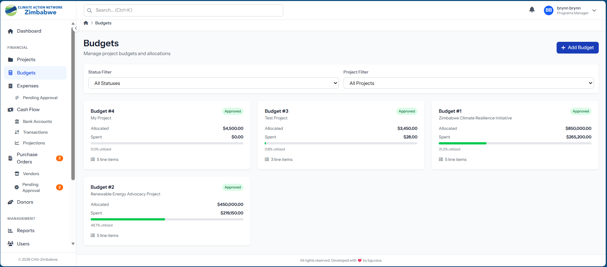
_Multi-project budget allocation and monitoring_

### Expense Approval Workflow

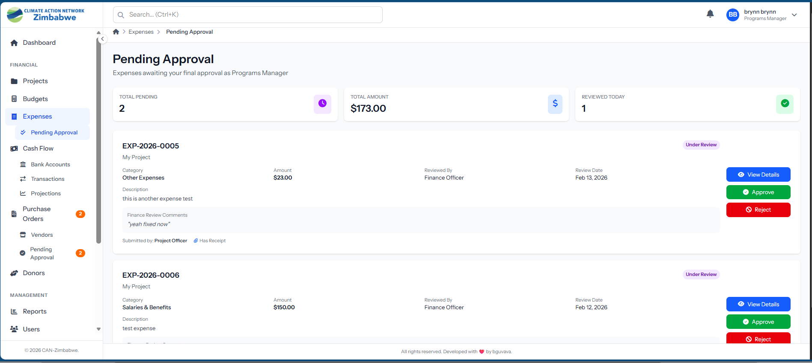
_Multi-step expense tracking and approval workflow_

### Donor & Funding Management

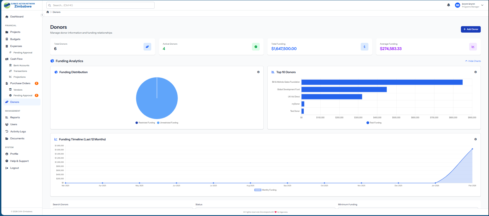
_Multi-donor support with funding source tracking_

### Cash Flow Management

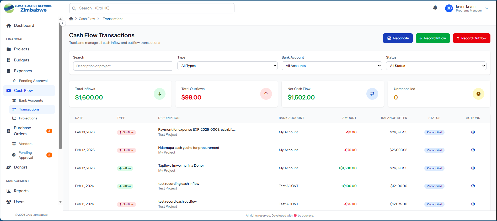
_Real-time cash flow tracking with bank account integration_

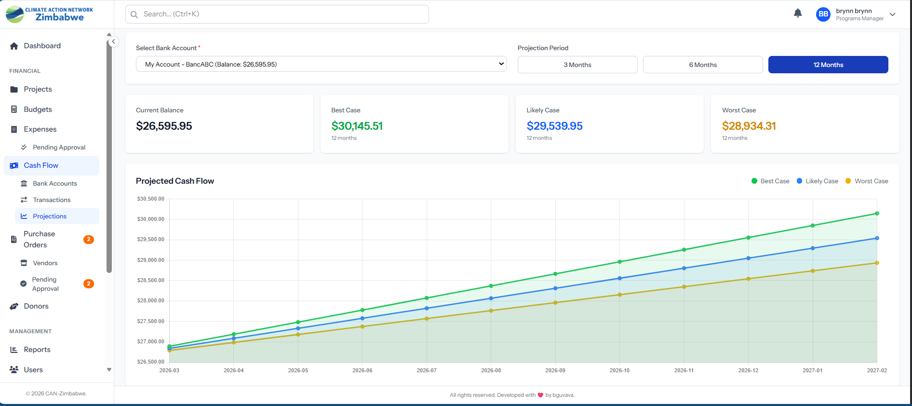
_Cash flow projections and financial forecasting_

### Purchase Orders & Vendors

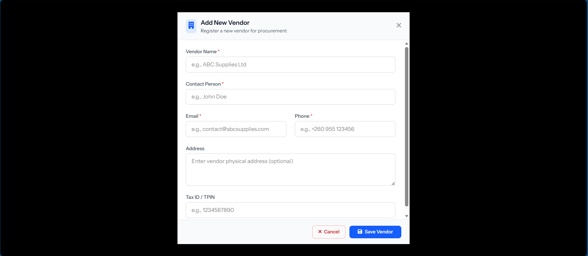
_Vendor management with purchase order processing_

### Document Management

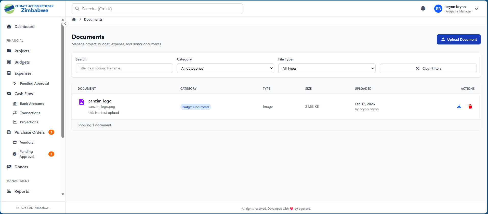
_Centralized document storage with version control_

### Reports

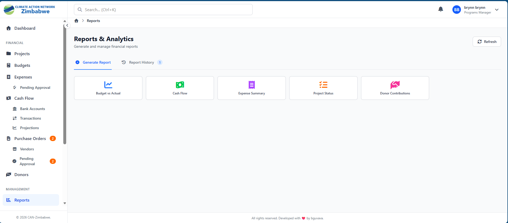
_Financial reports with PDF export functionality_

### Activity Logging & Audit Trail

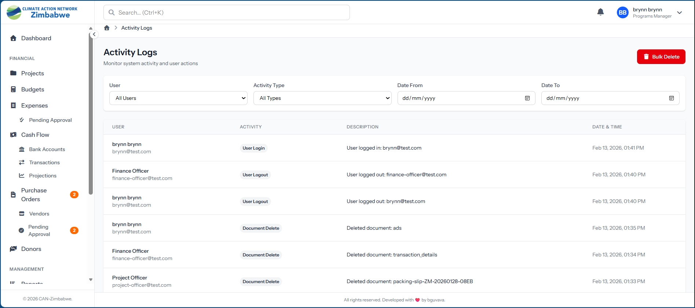
_Comprehensive audit trail and activity logging_

### Session Security

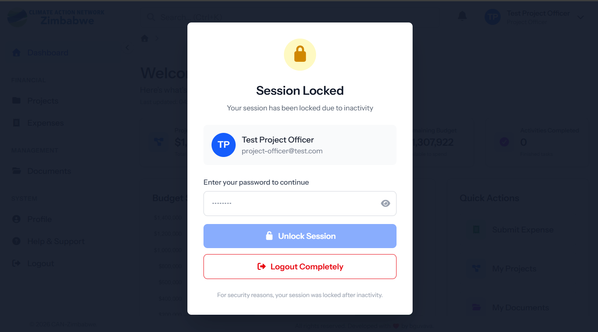
_Session lock screen after 5-minute inactivity timeout_

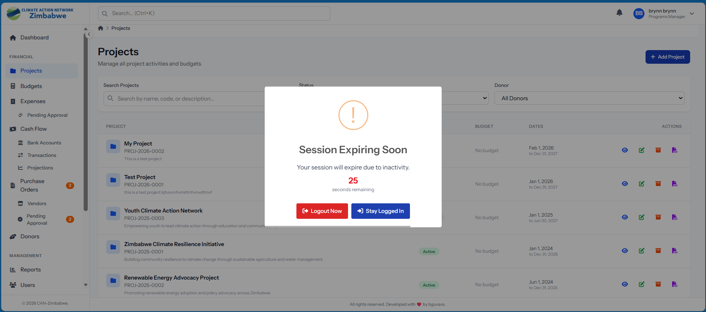
_Session expiry notification with re-authentication_

### User Manual

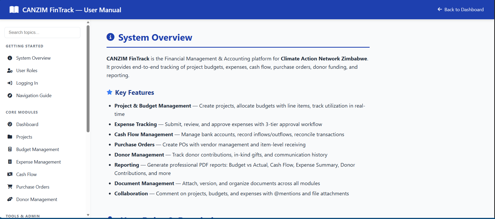
_Built-in user manual and help documentation_

---

## Key Features

### CANZIM Branding

- Official CANZIM logos integrated
- Consistent blue color scheme (#1E40AF)
- Professional PDF reports with branded headers

### SweetAlert2 Integration

- Custom CANZIM theme
- Smooth animations (250ms)
- Toast notifications
- Session timeout warnings
- Confirmation dialogs

### Smooth Animations

- Page transitions (200ms fade-in)
- Modal slide animations (250ms)
- Button hover effects (150ms)
- Loading spinners and skeleton screens
- Respects `prefers-reduced-motion` for accessibility

### Session Management

- 5-minute inactivity timeout
- Auto-logout with confirmation
- Database-backed sessions

### API-First Architecture

- RESTful API endpoints (`/api/v?/*`)
- Laravel Sanctum token authentication
- JSON response format
- CORS configured for SPA

---

## Security Features

- ✅ Laravel Sanctum API authentication
- ✅ CSRF protection
- ✅ XSS prevention
- ✅ SQL injection prevention (Eloquent ORM)
- ✅ Password hashing (bcrypt)
- ✅ Session timeout (5 minutes)
- ✅ Input validation
- ✅ Secure headers

---

## Contributing

This is a proprietary project developed for Climate Action Network Zimbabwe. For development questions or issues, contact the developer.

---

## Developer

**Developed with ❤️ by [bguvava](https://bguvava.com)**

- Portfolio: https://bguvava.com
- Email: guvava.brian@gmail.com
- Pnone: +263719333660

---

## License

Proprietary - Climate Action Network Zimbabwe © 2026

---

## Acknowledgments

- **Client:** Climate Action Network Zimbabwe (CAN Zimbabwe)
- **Framework:** Laravel (Taylor Otwell and contributors)
- **Frontend:** Vue.js (Evan You and contributors)
- **Styling:** TailwindCSS (Adam Wathan and contributors)

---
